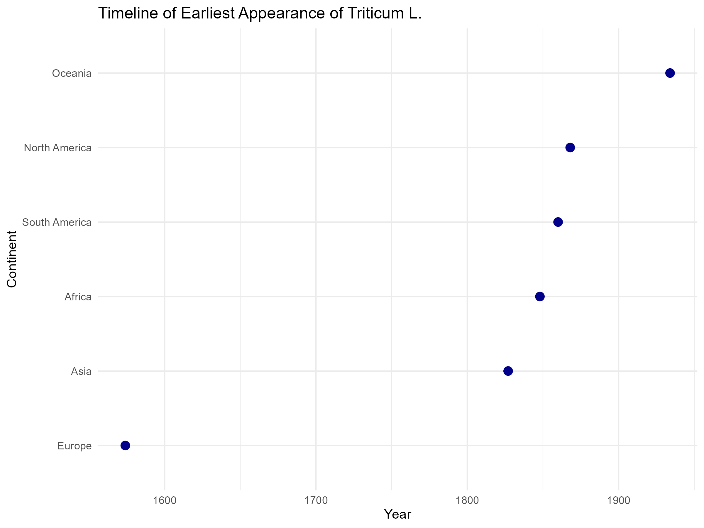
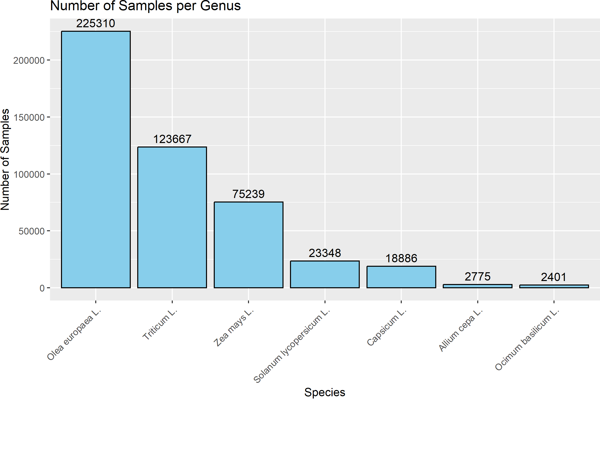
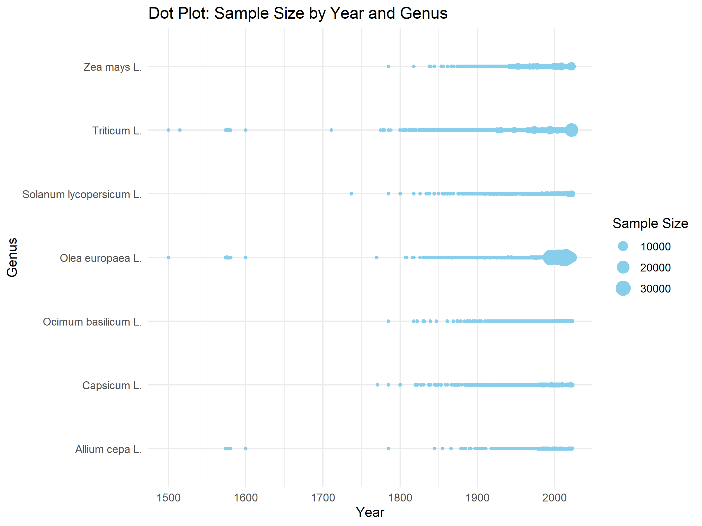

```{r load_packages, echo=FALSE, message=FALSE, warning=FALSE}
# Loading packages
library(rgbif)
library(dplyr)
library(ggplot2)
library(tidyr)
library(lubridate)
library(countrycode)
library(rnaturalearth)
library(rnaturalearthdata)
library(RColorBrewer)
library(magick)
library(gganimate) # Version 1.0.7
library(transformr) # Version 0.1.3
library(sf)
library(here)
library(maps)
```

This is the report for the semester project of the course ´Proseminar in
Geocomputation and Earth Observation´ HS23 and shows an Applied Geo-Data
Science project.

Supervisor: Prof. Dr. Benjamin Stocker, Dr. Laura Marques, Pepa Aran

# Introduction

Pizza is probably one of the most famous dishes in Europe and probably in
most parts of the world. As popular as pizza is, there are numerous ways to
prepare it and what toppings are used. But nevertheless, ingredients are
coming from all over the world, and those have not always been local to
Europe or other parts of the world.

So this project aims to answer the following research question: "How is the
historical journey of some selected pizza ingredients over continents and
time, and how can the results be presented in an appealing animation?"

Exploring the global history of the ingredients of a pizza helps us not
only to enrich our understanding of the past but also to appreciate more
the cultural diversity that has shaped our culinary experiences. The
journey of food around the world isn't a new topic, as shown by the study
Origins of Food Crops [@khoury2016], which connects countries worldwide. In
association with this study, a
[website](https://blog.ciat.cgiar.org/origin-of-crops/) has been created to
show plotted data, for example, where food crops come from and where they
are eaten now.

(Background, Relevance, Motivation)

# Methods and Data

As I said in the introduction, there are a lot of different ways to prepare
a pizza. For this project, an easy-to-prepare dough is used from [Betty
Bossi](https://www.bettybossi.ch/de/Home/Index), which is a cooking recipe
provider. This
[recipe](https://www.bettybossi.ch/de/Rezept/ShowRezept/BB_ITKU120801_0243A-40-de)
contains water, salt, flour (mostly wheat), yeast, and olive oil. Possible
vegetarian topics include corn, tomatoes, onions, paprika, cheese, and
basil. For this project, only species (or scientific genera) are considered
and no processed food. So the ingredients considered are: wheat (Triticum),
olive (Olea europaea), corn (Zea mays), tomatoes (Solanum lycopersicum),
onions (Allium cepa), paprika (Capsicum), and basil (Ocimum basilicum).

To get the needed data about the ingredients, the database "Global
Biodiversity Information Facility" [(GBIF)](https://www.gbif.org/) is used
as the basis for this project. GBIF was originally planned to be an
international mechanism to make biodiversity data and information
accessible worldwide. And then it was established in 2001 with the approval
of the Organization for Economic Cooperation and Development (OECD). GBIF
provides data on all types of life on earth and, for this project,
especially important records on occurrences. These occurrence records are
here used to identify the earliest appearance of a species on a continent.
Each occurrence is provided with the scientific name, country or area,
coordinates, year, basis of record, data set, and more. For downloading the
data, the package [@rgbif] can be used, but only with a free GBIF account.
To avoid this, the data downloading is done and described in more detail in
the other markdown [Downloading_data](Downloading_data.RMD). The data used
in this markdown is therefore saved in the folder Data_ingredients
[(combined_data)](../Data_ingredients/cleaned/combined_data.csv). First,
the data for the seven selected genera (also saved in the mentioned folder)
were downloaded individually and filtered by some quality markers (like
removing absent records and removing data with high coordinate
uncertainty). After this, the data got shortened to the only needed columns
(scientific name, year, and country code). The rows with missing values in
these columns were excluded. At the end, the seven data files got merged
into one (combined_data) for easier handling in the follow-up.

### Merging UNSD_M49.csv with combined_data.csv

To find out when a species appeared on a continent, the occurrence data
needs to be extended with information about continents. This is done with
the data set UNSD_M49 from the [United Nations
(UN)](https://unstats.un.org/unsd/methodology/m49/overview/), where
geographic regions are defined. According to the UN, each country has a
defined region and subregion. As regions, Africa, Antarctica, the Americas,
Asia, Europe, and Oceania are defined. There is no data provided in GBIF
for Antarctica, so this is ignored, whereas the subregion is used for the
Americas, so Latin America and the Caribbean (renamed South America) and
Northern America (renamed North America).

In the combined_data set, there are not only the genus but also the species
and subspecies mentioned, e. g., for Triticum L. there are around 134
different ones. For that reason, the scientificName column gets filtered
for the words Triticum, Olea, Zea, Solanum, Allium, Capsicum and Ocimum.
Those define them and are then altered to the scientific name,
respectively, of their genus.

```{r}
combined_data <- read.csv(here("Data_ingredients", "cleaned", "combined_data.csv"))
UNSD_M49 <- read.csv(here("Data", "UNSD_M49.csv"))

# Remove rows with NA in countryCode
combined_data_e <- combined_data[complete.cases(combined_data$countryCode), ]

# Separate the UNSD_M49 data frame by semicolon
UNSD_M49_split <- separate(data = UNSD_M49,
                            col = "Region_Code.Region.Name.Sub.region.Code.Sub.region.Name.ISO_alpha2_Code",
                            into = c("Region_Code", "Region_Name", "Subregion_Code", "Subregion_Name", "ISO_alpha2_Code"),
                            sep = ";", fill = "right", convert = TRUE)


# Find rows with missing values after separation
problematic_rows <- apply(UNSD_M49_split, 1, function(row) any(is.na(row)))

# Remove problematic rows from UNSD_M49_split
UNSD_M49_c <- UNSD_M49[complete.cases(UNSD_M49), ]

# Merging data frames
merged_data <- merge(combined_data_e, UNSD_M49_split, by.x = "countryCode", by.y = "ISO_alpha2_Code", all.x = TRUE)

# Check if "americas" is present in Region_Name, if true, use Subregion_Name
merged_data$Region_Name <- ifelse(merged_data$Region_Name == "Americas", merged_data$Subregion_Name, merged_data$Region_Name)

# Remove Subregion_Name column if it's no longer needed
merged_data <- merged_data[, !(names(merged_data) %in% c("Subregion_Name"))]

# Changing the UN Definition Names
merged_data$Region_Name <- ifelse(merged_data$Region_Name == "Latin America and the Caribbean", "South America", merged_data$Region_Name)

merged_data$Region_Name <- ifelse(merged_data$Region_Name == "Northern America", "North America", merged_data$Region_Name)

# Keeping only the needed columns
merged_data <- merged_data[, c("countryCode", "X", "scientificName", "year", "Region_Name")]

# Extracting species names (remove anything after the space)
merged_data$speciesName <- gsub(" .*", "", merged_data$scientificName)

# Filtering based on species of interest
species_sup <- c("Triticum", "Olea", "Zea", "Solanum", "Allium", "Capsicum", "Ocimum")


# Remove rows with NA or are blank in Region_Name
filtered_data <- merged_data %>%
  filter(!is.na(Region_Name) & Region_Name != "") %>%
  filter(speciesName %in% species_sup)

# Adding the mapping of species names to scientific names
species_mapping <- c("Triticum" = "Triticum L.",
                      "Olea" = "Olea europaea L.",
                      "Zea" = "Zea mays L.",
                      "Solanum" = "Solanum lycopersicum L.",
                      "Allium" = "Allium cepa L.",
                      "Capsicum" = "Capsicum L.",
                      "Ocimum" = "Ocimum basilicum L.")

# Replacing speciesName with scientific names based on the mapping
filtered_data$speciesName <- species_mapping[filtered_data$speciesName]


# Save merged_data to the "Data" folder
write.csv(merged_data, here("Data", "merged_data.csv"), row.names = FALSE)

# Save filtered_data to the "Data" folder
write.csv(filtered_data, here("Data", "filtered_data.csv"), row.names = FALSE)


```

### Better understanding the data

```{r}
# Scientific Names of the seven ingredients
species_of_interest <- c("Triticum L.", "Olea europaea L.", "Zea mays L.", "Solanum lycopersicum L.", "Allium cepa L.", "Capsicum L.", "Ocimum basilicum L.")

# Filtering the data for species_of_interest and calculate the counts
filtered_data1 <- filtered_data %>%
  filter(speciesName %in% species_of_interest) %>%
  group_by(speciesName) %>%
  summarise(count = n())

# Setting the plot width
options(repr.plot.width = 10) 

# Arranging the data by count in descending order
filtered_data1 <- filtered_data1 %>% 
  arrange(desc(count))

# Creating the plot
sample_number <- ggplot(filtered_data1, aes(x = reorder(speciesName, -count), y = count)) +
  geom_bar(stat = "identity", fill = "skyblue", color = "black") +
  geom_text(aes(label = count), vjust = -0.5, color = "black") +
  labs(title = "Number of Samples per Genus",
       x = "Species",
       y = "Number of Samples") +
  theme(axis.text.x = element_text(angle = 45, hjust = 1),
        plot.margin = margin(b = 50)) 


# Printing the plot
 print(sample_number)
 
# Saving the plot
 ggsave(here("Data", "data_analysis", "samples_genus.png"), sample_number, width = 8, height = 6)
```

```{r}
# Aggregating information
     count_data <- filtered_data %>%
     group_by(year, speciesName) %>%
     summarise(count = n())
 
# Plotting a dot plot
 dot_plot <- ggplot(count_data, aes(x = year, y = speciesName, size = count)) +
     geom_point(color = "skyblue") +
     labs(title = "Dot Plot: Sample Size by Year and Genus",
          x = "Year",
          y = "Genus",
          size = "Sample Size") +
     theme_minimal()
 
# Printing the plot
 print(dot_plot)

# Saving the plot
 ggsave(here("Data", "data_analysis", "samples_year_genus.png"), dot_plot, width = 8, height = 6)
```

### Filtering Data

```{r}
# Filtering merged_data for samples per continent
samples_per_continent <- filtered_data %>%
     group_by(Region_Name) %>%
     summarise(Number_of_Samples = n())
 
 # Printing the result
 print(samples_per_continent)

 # Saving the result
  ggsave(here("Data", "data_analyse", "samples_continent.csv", plot = samples_per_continent))
```

#### Earliest appearance per continent (EAC)

Here, the new combined and then filtered data set (filtered_data.csv), is
filtered for the earliest appearance of each species per continent.

```{r}
# Loading filtering_EAC function
source(here("R_functions", "filtering_EAC.R"))

```

#### Plotting the EAC

For a more useful presentation of the data, the EAC is plotted. Therefore,
the continents are ordered by their earliest appearance year and are then
plotted in a timeline.

```{r}
# Loading the function to plot the EAC on a timeline
source(here("R_functions", "plotting_EAC.R"))

```

### Plotting the Data on a Map and animating it

As there is now information available about the EAC of each genera, it all
gets plotted on a world map. This map shows the earliest appearance of a
ingredient from the GBIF Database on an continent. And I animated with the
package @gganimate.

```{r}
# Loading function to animate the maps
# source(here("R_functions", "EAC_wm_animation.R"))

# Loading world data
world <- ne_countries(scale = "medium", returnclass = "sf")

# Standardizing continent names in world data
world <- world %>%
  mutate(region_un = case_when(
    region_un %in% c("Asia", "Oceania", "South America", "North America", "Africa", "Europe") ~ region_un,
    TRUE ~ "Other"
  ))

# Function to animate the EAC on the world map
create_species_map <- function(species_name) {
  
  # Reading the corresponding EAC CSV file
  species_result <- read.csv(here("EAC_ingredients", "EAC", paste0(gsub(" ", "_", species_name), "_EAC.csv")))
  
  
  # Ordering the data frame by EarliestAppearance in ascending order
  species_result <- species_result %>% arrange(earliest_year)
  
  # Getting the order of continents based on the first appearance year
  continent_order <- species_result %>%
    group_by(continent) %>%
    summarize(first_appearance = min(earliest_year)) %>%
    arrange(first_appearance) %>%
    pull(continent)
  
  # Defining custom order for y-axis
  custom_order <- continent_order
  
  # Creating a factor variable for Continent with the custom order
  species_result$continent <- factor(species_result$continent, levels = custom_order)
  
  # Merging species_result data frame with continent boundaries
  merged_data <- merge(world, species_result, by.x = "continent", by.y = "continent")
  
  # Creating the map
  map_plot  <-  ggplot() +
    borders("world", colour = "gray85", fill = "gray80") +
    geom_sf(data = merged_data,aes(fill = earliest_year)) +
    scale_fill_viridis_c() +
    labs(title = paste(species_name),
         fill = "Year of First \nAppearance") +
    theme_minimal() +
    theme(plot.background = element_rect(fill = "white"),
          legend.background=element_blank(),
          axis.title=element_blank(),
          legend.key.size = unit(0.6, 'cm'),
          legend.title=element_text(size=9), 
          legend.text=element_text(size=8)) +
    coord_sf(label_axes = "both")
  
  # Printing the map plot
  print(map_plot)
  
  # Creating a folder for each species
  species_folder <- here("EAC_ingredients", "maps", gsub(" ", "_", gsub("\\.", "", species_name)), "/")
  dir.create(species_folder, showWarnings = FALSE)
  
  # Saving the map plot
  ggsave(paste0(species_folder, "earliest_appearance.png"), plot = map_plot, width = 8, height = 6)
 

# Animating the map using gganimate
animated_map <- map_plot +
  transition_states(states = earliest_year, transition_length = 2, state_length = 1) +
  labs(title = paste(species_name),
       subtitle = 'Year: {closest_state}')

# Printing the animated map
print(animated_map)

# Creating a filename for the animated map
animated_map_filename <- here(species_folder, "animated_map.gif")

# Saving the animated map directly
tryCatch({
  anim_save(animated_map_filename, animation = animated_map)
}, error = function(e) {
  cat("Error saving animated map:", e$message, "\n")
})


  
}
 
# Looping over species names and create map plots
lapply(species_of_interest, function(species_name) {
  cat("Processing species:", species_name, "\n")
  create_species_map(species_name)
})
```

# Results

The underlying code presents, as a result, the spread of the seven chosen
ingredients per continent and time on an animated world map. So the map
shows from the seven chosen ingredients: wheat, olive, corn, tomatoes,
onions, paprika and basil, when their first occurrence on a continent is
recorded and saved in GBIF. The animation shows in an simple way this
journey and also show, that there is a difference on when an ingredient
appeared on a continent. As there are the same plots and maps used for each
ingredient, the results are here mainly shown with the example Triticum L.

Let's first have a look on the animated world map:

Here we see, that the first occurence is in Europe, then Asia, Africa,
South America, Oceania and at last North America. Also the first occurence
year is shown, but for easier acces is this data also provided in a
dataframe in the filtering EAC chunk. The plotted timeline shows the
correlation between year and continent.



But to get to this animation and this plot it's also very important to
understand the data I'm working with. As the feasibility example has
already shown, there is an issue with the data from GBIF. Although GBIF has
data from 1000 to 2023, that doesn't mean there is data provided for each
species during this time period. Also, the availability of data on GBIF
depends a lot on the scientific stand, whether data is provided to GBIF and
whether it meets the [standards of
GBIF](https://www.gbif.org/what-is-gbif#:~:text=This%20knowledge%20derives%20from%20many,in%20recent%20days%20and%20weeks).
So the first appearance date only represents the first appearance that is
registered in the GBIF database. To get a better insight on that data
issue, the chosen data has been analysed. Through this analysis it can be
seen, that the presence of data differs strongly between genera, continent
and time, for the data of the seven chosen ingredients. For example for
'Olea europaea L.' about 223'000 occurrences were processed, where as
'Ocimum basilicum L.' only has about 2'400 different occurrences. The same
problems occurs between the continents so Europe has around 332'000 samples
and North America only around 9'400.



And the biggest data issue for this specific project is the sample size by
year and species. As the majority of data is provided for approximately the
years 1850 to nowadays. In this time periode there are up to 30'000 samples
per year and genus provided. The first date in the used data is in 1500 in
Europe for 'Triticum L.' and 'Olea europaea L.'



The resulted data stats that the first occurrences were for all ingredients
in Europe "Triticum L.","Europe",1500 Zea mays L.","Europe",1785 "Capsicum
L.","Europe",1771 "Allium cepa L.","Europe",1574 "Olea europaea
L.","Europe",1500 "Solanum lycopersicum L.","Europe",1737

Vgl. Khoury Tomatoes: Andes (south america) Maize: Central America and
Mexico (north America) Papric not data onion: west asia, central asia
olive: East africa, southwestern europe, south and east mediterranean
(africa), west asia, southern europe, wheat: central asia, west asia, south
and est meditteranean (africa)

(Reports the results in a logical order that facilitates reading - from the
general pattern to the details. Basic and central finding first, then the
nuance.)

# Discussion

(Explain what the results mean in relation to the question stated in the
Introduction. Discuss caveats, compare to earlier findings, and explain the
relevance of your results.)\
Aussicht: könntes für die einzelnen Länder machen, bessere Daten Grundlage

# References
