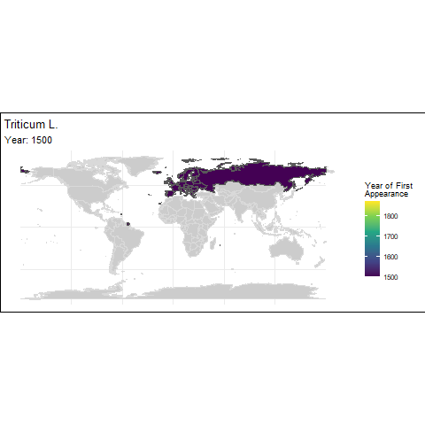

```{r load_packages, echo=FALSE, message=FALSE, warning=FALSE}
# Loading packages
library(dplyr)
library(ggplot2)
library(tidyr)
library(lubridate)
library(countrycode)
library(rnaturalearth)
library(rnaturalearthdata)
library(RColorBrewer)
library(magick)
library(gganimate) # Version 1.0.7
library(transformr) # Version 0.1.3
library(sf)
library(here)
library(maps)
```

This is the report for the semester project of the course ´Proseminar in
Geocomputation and Earth Observation´ HS23 and shows an Applied Geo-Data
Science project.

Supervisor: Prof. Dr. Benjamin Stocker, Dr. Laura Marques, Pepa Aran

# Introduction

Pizza is probably one of the most famous dishes in Europe and probably in
most parts of the world. As popular as pizza is, there are numerous ways to
prepare it and what toppings are used. But nevertheless, ingredients are
coming from all over the world, and those have not always been local to
Europe or other parts of the world.

So this project aims to answer the following research question: "How is the
historical journey of some selected pizza ingredients over continents and
time, and how can the results be presented in an accessible animation?"

Exploring the global history of the ingredients of a pizza helps us not
only to enrich our understanding of the past but also to appreciate more
the cultural diversity that has shaped our culinary experiences. Using the
ingredients from pizza helps for an holistic understanding of our global
food heritage and can give an insight on social, environmental, economic,
cultural and historical aspects.

The journey of food around the world isn't a new topic, as shown by the
study Origins of Food Crops [@khoury2016], which stats that 68.7% of
national food supplies as a global mean are derived from foreign crops and
69.3% of crops grown are foreign. In association with this study, a
[website](https://blog.ciat.cgiar.org/origin-of-crops/) has been created to
show plotted data, for example, where food crops come from and where they
are eaten now. Overall the study puts a spot on the the extensive
connection among countrires and regions worldwide regarding origins of
crops. This study motivates this project, to show these worldwide
connections in an accessible way, more precisely an animation, with a
different database.

# Methods and Data

As mentioned in the introduction, there are a lot of different ways to
prepare a pizza. For this project, an easy-to-prepare dough is used from
[Betty Bossi](https://www.bettybossi.ch/de/Home/Index), which is a famous
swiss cooking recipe provider. This
[recipe](https://www.bettybossi.ch/de/Rezept/ShowRezept/BB_ITKU120801_0243A-40-de)
contains water, salt, flour (mostly wheat), yeast, and olive oil. Possible
vegetarian topics include corn, tomatoes, onions, paprika, cheese, and
basil. For this project, only species (or scientific genera) are considered
and no processed food. So the ingredients considered are: wheat (Triticum),
olive (Olea europaea), corn (Zea mays), tomatoes (Solanum lycopersicum),
onions (Allium cepa), paprika (Capsicum), and basil (Ocimum basilicum).
Individually or in various combinations, those ingredients are often used
for a pizza and therefore give the reader of this project a more direct
access to the focus of this report.

To get the needed data about the ingredients, the database "Global
Biodiversity Information Facility" [(GBIF)](https://www.gbif.org/) is used
as the basis for this project. GBIF was originally planned to be an
international mechanism to make biodiversity data and information
accessible worldwide. And then it was established in 2001 with the approval
of the Organization for Economic Cooperation and Development (OECD). GBIF
provides data on all types of life on earth and, for this project,
especially important records on occurrences. These occurrence records are
here used to identify the earliest appearance of a species on a continent.
Each occurrence is provided with the scientific name, country or area,
coordinates, year, basis of record, data set, and more. For downloading the
data, the package [@rgbif] can be used, but only with a free GBIF account.
That's why the downloading is done in a different markdown
([Downloading_data](Downloading_data.RMD).Rmd). The following passage
explains how this data was accessed.

### Data Quality Assessment

GBIF's commits to data standards like Darwin Core, EML (Ecological Metadata
Language), and BioCASe/ABCD for a good [data
standard](https://www.gbif.org/standards). However, to address potential
issues, the following steps were taken:

1.  **Individual Data Download:** Data for the seven selected genera were
    downloaded individually from GBIF, ensuring a focused approach to each
    ingredient.

2.  **Quality Markers:** Quality markers were applied during the filtering
    process, including the removal of absent records and data with high
    coordinate uncertainty.

3.  **Column Selection:** The data was shortened down to the essential
    columns: scientific name, year, and country code.

4.  **Exclusion of Missing Values:** Rows with missing values in critical
    columns were excluded to enhance the reliability of the dataset.

5.  **Merging**: All seven data files were merged into one
    [(combined_data)](../Data_ingredients/cleaned/combined_data.csv), for
    more forward handling in the following analyses.

For more detailed information on data downloading, please refer to the
[Downloading data](Downloading_data.RMD) markdown.

### Merging UNSD_M49.csv with combined_data.csv

To find out when a species appeared on a continent, the occurrence data
needs to be extended with information about continents. This is done with
the data set UNSD_M49 from the [United Nations
(UN)](https://unstats.un.org/unsd/methodology/m49/overview/), where
geographic regions are defined. According to the UN, each country has a
defined region and subregion. As regions, Africa, Antarctica, the Americas,
Asia, Europe, and Oceania are defined. There is no data provided in GBIF
for Antarctica, so this is ignored, whereas the subregion is used for the
Americas, so Latin America and the Caribbean (renamed South America) and
Northern America (renamed North America), to get a more detailed result.

In the combined_data set, there are not only the genus but also the species
and subspecies mentioned, e. g., for Triticum L. there are around 134
different ones. For that reason, the scientificName column gets filtered
for the words Triticum, Olea, Zea, Solanum, Allium, Capsicum and Ocimum.
Those define them and are then altered to the scientific name,respectively,
of their genus.

```{r}
# Loading read_data script
  source(here("R_functions", "read_data.R"))

# Loading merge_data script
  source(here("R_functions", "merge_data.R"))

# Loading filter_saved_data script
  source(here("R_functions", "filter_saved_data.R"))
```

### Better understanding the data

```{r}
# Loading sample_size_genus.R
  source(here("R_functions", "sample_size_genus.R"))
```

```{r}
# Aggregating information
     count_data <- filtered_data %>%
     group_by(year, speciesName) %>%
     summarise(count = n())
 
# Plotting a dot plot
 dot_plot <- ggplot(count_data, aes(x = year, y = speciesName, size = count)) +
     geom_point(color = "skyblue") +
     labs(title = "Dot Plot: Sample Size by Year and Genus",
          x = "Year",
          y = "Genus",
          size = "Sample Size") +
     theme_minimal()
 
# Printing the plot
 print(dot_plot)

# Saving the plot
 ggsave(here("Data", "data_analysis", "samples_year_genus.png"), dot_plot, width = 8, height = 6)
```

### Filtering Data

```{r}
 # Filtering merged_data for samples per continent
 samples_per_continent <- filtered_data %>%
     group_by(Region_Name) %>%
     summarise(Number_of_Samples = n())
 
 # Printing the result
 print(samples_per_continent)

 # Saving the result
 write.csv(samples_per_continent, file = here("Data", "data_analysis", "samples_continent.csv"), row.names = FALSE)

```

#### Earliest appearance per continent (EAC)

Here, the new combined and then filtered data set (filtered_data.csv), is
filtered to compare the occurrence patterns of the selected ingredients
across the continents. The EAC allows pinpointing when and where a genus
appeared on a continent, and so also gives us a glimpse into historical
patterns of trade, migration and cultural exchange.

```{r}
# Loading filtering_EAC function
  source(here("R_functions", "filtering_EAC.R"))
```

#### Plotting the EAC

For a more useful presentation of the data, the EAC is plotted. Therefore,
the continents are ordered by their earliest appearance year and are then
plotted in a timeline.

```{r}
# Loading the function to plot the EAC on a timeline
  source(here("R_functions", "plotting_EAC.R"))
```

### Plotting the Data on a Map and animating it

As there is now information available about the EAC of each genera, it all
gets plotted on a world map. This map shows the earliest appearance of a
ingredient from the GBIF Database on an continent. Those are animated with
the package @gganimate and saved in the path EAC_ingredients/maps/.

```{r}
# Loading world data
world <- ne_countries(scale = "medium", returnclass = "sf")

# Standardizing continent names in world data
world <- world %>%
  mutate(region_un = case_when(
    region_un %in% c("Asia", "Oceania", "South America", "North America", "Africa", "Europe") ~ region_un,
    TRUE ~ "Other"
  ))

# Loading function to animate the maps
source(here("R_functions", "EAC_wm_animation.R"))

# Looping over species names and create animated map
lapply(species_of_interest, function(species_name) {
  cat("Processing species:", species_name, "\n")
  
  # Measure the time for each iteration
  timing <- system.time({
    create_species_map(species_name)
  })
  
  cat("Elapsed time:", timing[3], "seconds\n\n")
})

```

# Results

#### **Animation**

The project code presents the spread of the seven selected ingredients
(wheat, olive, corn, tomatoes, onions, paprika and basil) across continents
and over time. Notably, the first appearance date represents registered
occurrences in the GBIF database and may not reflect the actual historical
introduction of ingredients.

#### **Example Triticum L.** 

This animation shows as the first occurrence Europe, then Asia, Africa,
South America, Oceania and at last North America. Also the first occurrence
year per continent is shown, but for easier acces is this data also
provided in a dataframe in the filtering EAC chunk.

The plotted timeline shows the correlation between year and continent.


#### **Data Challenges**

The availability of Data on GBIF varies significantly over the timespan
from 1500 to 2023, the continent and over genera. For example for 'Olea
europaea L.' about 223'000 occurrences were processed, where as 'Ocimum
basilicum L.' only has about 2'400 different occurrences. The same problems
occurs between the continents so Europe has around 332'000 samples and
North America only around 9'400.


As The majority of data is provided for approximately the years 1850 to
nowadays. In this time periode there are up to 30'000 samples per year and
genus provided. The first date in the used data is in 1500 in Europe for
'Triticum L.' and 'Olea europaea L.'


#### **Evaluation of EAC**

The evaluated EAC state the the first occurrences are for all seven
ingredients in Europe, although with different appearing years. Here the
data issue is clearly visible. A comparison with Khoury's (2016) study
reveals broader variability in the primary regions of diversity for each
ingredient.

Comparison:

-   Tomatoes: Andes

-   Corn: Central America and Mexico

-   Onion: West Asia, Central Asia

-   Olive: East Africa, Southwestern Europe, South and East Mediterranean,
    West Asia, Southern Europe,

-   Wheat: Central Asia, West Asia, South and East Mediterranean

No data was available for Paprika and Basil.

#### **Summary**

The findings emphasize the importance of understanding data limitations and
discrepancies when interpreting the historical journey of pizza
ingredients.

# Discussion

The journey around the world of wheat, olives, corn, tomatoes, onions,
paprika and basil is analysed regarding the historical occurrences. And the
results are presented in visual formats, including animated maps and
timelines. Though some caveats are needed to be considered. So e. g. the
data limitation and data source reliability (adressed in the sections [Data
Quality Assessment] and [Data Challenges]). Furthermore, historical records
propose a challenge as they could be incomplete or can depend on the
research status.

This projects relevance is given through having a accessible visualization
generated. Giving a small incentive to discuss about food, culture and
global connections. Additionally it shows future directions.

#### **Future Directions**

An other database with more extensive data could be used. For example data
from the Food and Agriculture Organization of the United Nation could be
checked. Exploring occurrences at the country level is a valuable and
insightful future direction. Mapping and animating the earliest appearances
of pizza ingredients per country would provide a more detailed
understanding of their historical journey. With an extended version of this
project could the findings be compared with with historical events,
cultural exchanges, or trade routes.

# References
