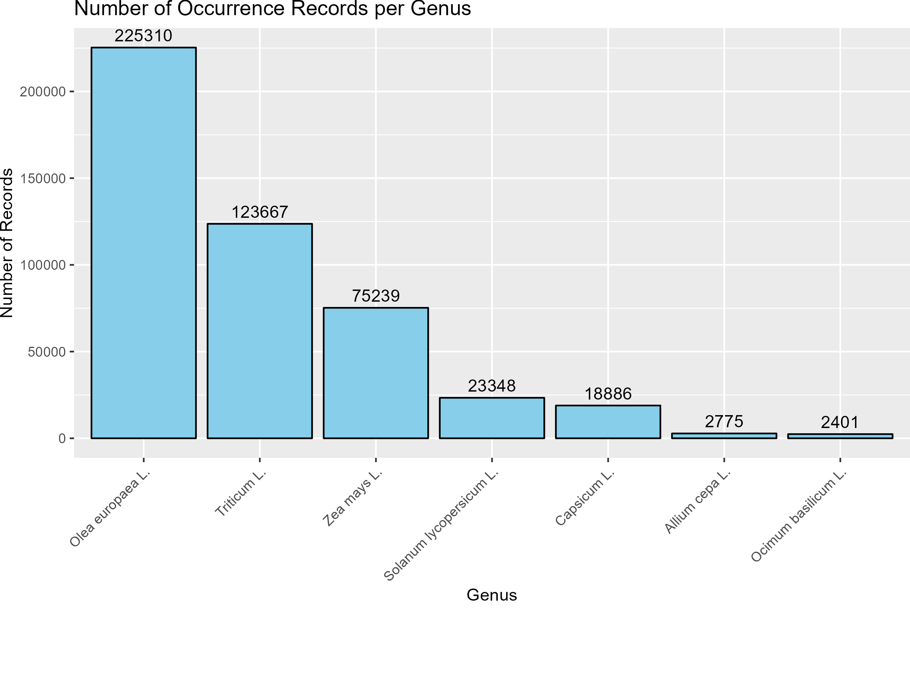
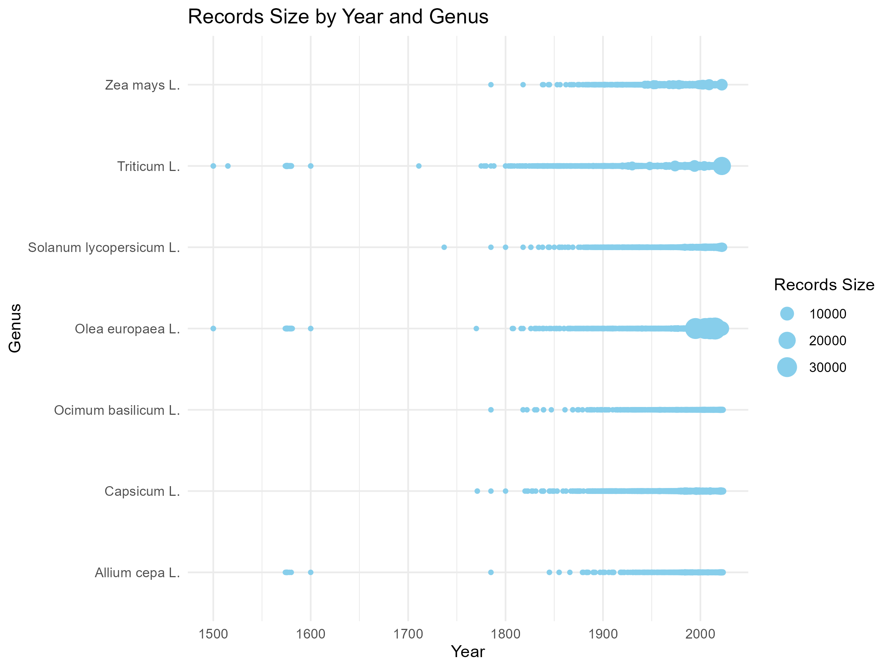

```{r package version, echo=FALSE, warning=FALSE}
# Checking if gganimate and transform is installed and has the correct version
if (!requireNamespace("gganimate", quietly = TRUE)) {
  install.packages("gganimate", dependencies = TRUE)
}

if (!requireNamespace("transformr", quietly = TRUE)) {
  install.packages("transformr", dependencies = TRUE)
}

tryCatch({
  # Loading gganimate and checking version
  library(gganimate)
  
  # Checking if the loaded version of gganimate is exactly 1.0.7
  if (packageVersion("gganimate") != "1.0.7") {
    stop("gganimate version 1.0.7 is required. Please install this specific version.")
  }
  
  # Loading transformr and checking version
  library(transformr)
  
  # Checking if the loaded version of transformr is exactly 0.1.3
  if (packageVersion("transformr") != "0.1.3") {
    stop("transformr version 0.1.3 is required. Please install this specific version.")
  }
}, error = function(e) {
  cat("Error:", conditionMessage(e), "\n")
})
```

```{r load_packages, echo=FALSE, message=FALSE, warning=FALSE}
# Loading packages
library(dplyr)
library(ggplot2)
library(tidyr)
library(lubridate)
library(countrycode)
library(rnaturalearth)
library(rnaturalearthdata)
library(RColorBrewer)
library(magick)
library(sf)
library(here)
library(maps)
library(viridis)
```

This is the report for the semester project of the course ´Proseminar in
Geocomputation and Earth Observation´ HS23 and shows an Applied Geo-Data
Science project.

Supervisor: Prof. Dr. Benjamin Stocker, Dr. Laura Marques, Pepa Aran

# Introduction

Pizza is probably one of the most famous dishes in Europe and probably in
most parts of the world. As popular as pizza is, there are numerous ways to
prepare it and what toppings are used. But nevertheless, ingredients are
coming from all over the world, and those have not always been local to
Europe or other parts of the world.

So this project aims to answer the following research question: "How is the
historical journey of pizza ingredients over continents and time, and how
can this be presented in an accessible animation?"

Exploring the global history of the ingredients of a pizza helps us not
only to enrich our understanding of the past but also to appreciate more
the cultural diversity that has shaped our culinary experiences. Using the
ingredients from pizza helps for an holistic understanding of our global
food heritage and can give an insight on social, environmental, economic,
cultural and historical aspects.

The journey of food around the world isn't a new topic, as shown by the
study Origins of Food Crops [@khoury2016], which stats that 68.7% of
national food supplies as a global mean are derived from foreign crops and
69.3% of crops grown are foreign. In association with this study, a
[website](https://blog.ciat.cgiar.org/origin-of-crops/) has been created to
show plotted data, for example, where food crops come from and where they
are eaten now. Overall the study puts a spot on the the extensive
connection among countries and regions worldwide regarding origins of
crops. This study motivates this project, to show these worldwide
connections in an accessible way, more precisely an animation, with a
different database.

# Methods and Data

As mentioned in the introduction, there are a lot of different ways to
prepare a pizza. For this project, an easy-to-prepare dough is used from
[Betty Bossi](https://www.bettybossi.ch/de/Home/Index), which is a famous
swiss cooking recipe provider. This
[recipe](https://www.bettybossi.ch/de/Rezept/ShowRezept/BB_ITKU120801_0243A-40-de)
contains water, salt, flour (mostly wheat), yeast, and olive oil. Possible
vegetarian topics include corn, tomatoes, onions, paprika, cheese, and
basil. For this project, only species (or scientific genera) are considered
and no processed food. So the ingredients considered are: wheat (Triticum
L.), olive (Olea europaea L.), corn (Zea mays L.), tomatoes (Solanum
lycopersicum L.), onions (Allium cepa L.), paprika (Capsicum L.), and basil
(Ocimum basilicum L.). Individually or in various combinations, those
ingredients are often used for a pizza and therefore give the reader of
this project a more direct access to the focus of this report.

To get the needed data about the ingredients, the database "Global
Biodiversity Information Facility" [(GBIF)](https://www.gbif.org/) is used
as the basis for this project. GBIF was originally planned to be an
international mechanism to make biodiversity data and information
accessible worldwide. And then it was established in 2001 with the approval
of the Organization for Economic Cooperation and Development (OECD). GBIF
provides data on all types of life on earth and, for this project,
especially important records on occurrences. These occurrence records are
here used to identify the earliest appearance of a genera on a continent.
Each occurrence is provided with the scientific name, country or area,
coordinates, year, basis of record, data set, and more. For downloading the
data, the package [@rgbif] can be used, but only with a free GBIF account.
That's why the downloading is done in a different markdown
([Downloading_data](Downloading_data.RMD).Rmd). The following passage
explains how this data was accessed.

### Data Quality Assessment

GBIF's commits to data standards like Darwin Core, EML (Ecological Metadata
Language), and BioCASe/ABCD for a good [data
standard](https://www.gbif.org/standards). However, to address potential
issues, the following steps were taken:

1.  **Individual Data Download:** Data for the seven selected genera were
    downloaded individually from GBIF, ensuring a focused approach to each
    ingredient.

2.  **Quality Markers:** Quality markers were applied during the filtering
    process, including the removal of absent records and data with high
    coordinate uncertainty.

3.  **Column Selection:** The data was shortened down to the essential
    columns: scientific name, year, and country code.

4.  **Exclusion of Missing Values:** Rows with missing values in critical
    columns were excluded to enhance the reliability of the dataset.

5.  **Merging**: All seven data files were merged into one
    [(combined_data)](../Data_ingredients/cleaned/combined_data.csv), for
    more forward handling in the following analyses.

For more detailed information on data downloading, please refer to the
[Downloading data](Downloading_data.RMD) markdown.

### Merging UNSD_M49.csv with combined_data.csv

To find out when a species appeared on a continent, the occurrence data
needs to be extended with information about continents. This is done with
the data set UNSD_M49 from the [United Nations
(UN)](https://unstats.un.org/unsd/methodology/m49/overview/), where
geographic regions are defined. According to the UN, each country has a
defined region and subregion. As regions, Africa, Antarctica, the Americas,
Asia, Europe, and Oceania are defined. There is no data provided in GBIF
for Antarctica, so this is ignored, whereas the subregion is used for the
Americas, so Latin America and the Caribbean (renamed South America) and
Northern America (renamed North America), to get a more detailed result.

In the combined_data set, there are not only the genus but also the species
and subspecies mentioned, e. g., for Triticum L. there are around 134
different ones. For that reason, the scientificName column gets filtered
for the words Triticum, Olea, Zea, Solanum, Allium, Capsicum and Ocimum.
Those define them and are then altered to the scientific name,respectively,
of their genus.

```{r}
# Loading read_data script
  source(here("R_functions", "read_data.R"))

# Loading merge_data script
  source(here("R_functions", "merge_data.R"))

# Loading filter_saved_data script
  source(here("R_functions", "filter_saved_data.R"))
```

### Better understanding of the data

```{r}
# Loading sample_size_genus.R
  source(here("R_functions", "records_size_genus.R"))
```

```{r}
# Aggregating information
     count_data <- filtered_data %>%
     group_by(year, speciesName) %>%
     summarise(count = n())
 
# Plotting a dot plot
 dot_plot <- ggplot(count_data, aes(x = year, y = speciesName, size = count)) +
     geom_point(color = "skyblue") +
     labs(title = "Records Size by Year and Genus",
          x = "Year",
          y = "Genus",
          size = "Records Size") +
     theme_minimal()
 
# Printing the plot
 print(dot_plot)

# Saving the plot
 ggsave(here("Data", "data_analysis", "records_year_genus.png"), dot_plot, width = 8, height = 6)
```

```{r}
# Filtering merged_data for records per continent
 records_per_continent <- filtered_data %>%
     group_by(Region_Name) %>%
     summarise(Number_of_Records = n())
 
# Printing the result
 print(records_per_continent)

# Saving the result
 write.csv(records_per_continent, file = here("Data", "data_analysis", "records_continent.csv"), row.names = FALSE)

#### Earliest appearance per continent (EAC)

Here, the new combined and then filtered data set (filtered_data.csv), is
filtered to compare the occurrence patterns of the selected ingredients
across the continents. The EAC allows pinpointing when and where a genus
appeared on a continent.

```{r}
# Loading filtering_EAC function
  source(here("R_functions", "filtering_EAC.R"))
```

#### Plotting the EAC

For a more useful presentation of the data, the EAC is plotted. Therefore,
the continents are ordered by their earliest appearance year and are then
plotted in a timeline.

```{r}
# Loading the function to plot the EAC on a timeline
  source(here("R_functions", "plotting_EAC.R"))
```

### Plotting the Data on a Map and animating it

As there is now information available about the EAC of each genera, it all
gets plotted on a world map. This map shows the earliest appearance of a
ingredient from the GBIF Database on an continent. Those are animated with
the package @gganimate and saved in the path EAC_ingredients/maps/.

```{r}
# Loading world data
world <- ne_countries(scale = "medium", returnclass = "sf")

# Standardizing continent names in world data
world <- world %>%
  mutate(region_un = case_when(
    region_un %in% c("Asia", "Oceania", "South America", "North America", "Africa", "Europe") ~ region_un,
    TRUE ~ "Other"
  ))

# Loading function to animate the maps
source(here("R_functions", "EAC_wm_animation.R"))

# Looping over species names and create animated map
lapply(species_of_interest, function(species_name) {
  cat("Processing species:", species_name, "\n")
  
  # Measure the time for each iteration
  timing <- system.time({
    create_species_map(species_name)
  })
  
  cat("Elapsed time:", timing[3], "seconds\n\n")
})

```

# Results

The project code presents the spread of the seven selected ingredients
(wheat, olive, corn, tomatoes, onions, paprika and basil) across continents
and over time.

#### **Example Triticum L.**

For each genera a timeline plot is generated as well as an animation
showing the journey around the world. In principle, all plots and
animations work the same, only differing in the underlying data. Wheat is
here chosen as an example.

The generated timeline shows the chronological distribution of the earliest
appearance of wheat, with the x-axis indicating the years and the y-axis
representing the continents, based on the GBIF data. The timeline shows the
distribution from Europe to Asia, Africa, South America, North America, and
then Oceania.


The same distribution pattern can be seen likewise in the animation. The
animation shows as well the first occurrence in Europe, then Asia, Africa,
South America, Oceania, and, at last, North America. Here, the exact year
of the first occurrence on a continent is shown. But this is not the only
thing that is different in comparison to the timeline plot. Plotting the
results on the world map and animating it gives more accessible access to
data, as they are visible and don't need to be interpreted from a
plot.{width="508"}

#### **Data Challenges**

The availability of data on GBIF varies significantly over the timespan
from 1500 to 2023, across continents, and over genera. When the records are
filtered by continents, a discrepancy is visible. Europe has around 332'000
records, and North America only has around 9'400. What could speak for a
research gap or problems in data consideration? The different volumes was
also highlighted in the report of the task group on 'GBIF Data Fitness for
Use in Distribution Modelling' [@anderson2015].

The plot 'Number of Samples per Genus' as well shows this variation in
availability. The plot displays the seven selected genera on a bar chart
displayed by their distribution of occurrence records over all continents.
Based on the data from GBIF, 'Olea europaea L.' is dominating, before
'Triticum L.' and 'Zea mays L.'. As an example, from 'Olea europaea L.'
about 223'000 records were processed, whereas from 'Ocimum basilicum L.'
only about 2'400 different records



The timespan also shows some data challenges. In the plot 'Records Size by
Year and Genus', the record sizes for all selected ingredients are
illustrated by years and genera with data from the GBIF database. Each dot
represents the count of occurrences in a specific year, with the dot size
indicating the sample size for a particular genus. The majority of the data
is provided for approximately the years 1850 to nowadays. In this time
period, there are up to 30'000 records per year and genus provided. The
first year appearing in the downloaded data is 1500 in Europe for 'Triticum
L.' and 'Olea europaea L.'



#### **Evaluation of the EAC**

The evaluated EAC states that the first occurrences for all seven
ingredients are in Europe, although with different appearing years. In more
detail, it shows the following journeys:

-   Wheat: Europe (1500), *Asia*, *Africa*, South America, Oceania, North
    America

-   Olive: *Europe* (1500), Oceania, *Africa*, *Asia*, South America, North
    America

-   Corn: Europe (1785), *North America, South America*, Asia, Africa,
    Oceania

-   Tomato: Europe (1737), *South America*, Asia, Africa, North America,
    Oceania

-   Onion: Europe (1574), Africa, North America, South America, *Asia*,
    Oceania

-   Paprika: Europe (1771), South America, Asia, Africa, North America,
    Oceania

-   Basil: Europe (1785), North America, Africa, South America, Asia,
    Oceania

A comparison with Khoury's (2016) study reveals broader variability in the
primary regions of diversity for each ingredient. All the continents
mentioned in the study as primary regions of diversity are written in
italics in the list above.

Origins, according to Khoury (no data was available for paprika and basil):

-   Wheat: Central Asia, West Asia, South and East Mediterranean

-   Olive: East Africa, Southwestern Europe, South and East Mediterranean,
    West Asia, Southern Europe

-   Corn: Central America and Mexico

-   Tomatoes: Andes

-   Onion: West Asia, Central Asia

#### **Summary**

The findings emphasize the importance of understanding data limitations and
discrepancies when interpreting the historical journey of the chosen
ingredients. Notably, the first appearance date may represents registered
occurrences in the GBIF database and not reflect the actual historical
introduction of ingredients.

# Discussion

The journey around the world of wheat, olives, corn, tomatoes, onions,
paprika, and basil is analyzed regarding historical occurrences. And the
results are presented in visual formats, including animated maps and
timelines. The results also show the connection between the continents,
which further promotes the need to address food challenges and
opportunities.

Though some caveats are needed to be considered, e.g., the data limitation
and data source reliability (adressed in the sections [Data Quality
Assessment] and [Data Challenges]). Furthermore, historical records pose a
challenge as they could be incomplete or depend on the research status.

This project's relevance is given by the accessible visualization
generated. Giving an incentive to discuss food, cultural, and global
connections. Additionally, it shows future directions in the same area as
this project. Another database with more extensive data could be used. Or
if there is no better database available, the data from GBIF could be
extended with self-gathered data, e.g., from archaeological investigations.
Also, exploring occurrences at the country level could be a valuable and
insightful future direction. Mapping and animating the earliest appearances
of pizza ingredients per country would provide a more detailed
understanding of their historical journey. Additionally, with an extended
version of this project, findings could be compared with historical events,
cultural exchanges, or trade routes. And so, show even more the
interconnections in our everyday meals that we take for granted.

# References
